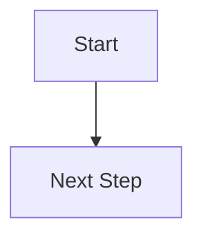

# Contributing to CC Club Website

Thank you for your interest in contributing to the Computer Coding Club website! This guide will help you make contributions whether you're updating content, fixing bugs, or adding new features.

## Table of Contents

- [Quick Start](#quick-start)
- [How to Add Content](#how-to-add-content)
  - [Adding a Blog Post](#adding-a-blog-post)
  - [Adding an Event](#adding-an-event)
  - [Updating Team Members](#updating-team-members)
  - [Updating Alumni](#updating-alumni)
  - [Adding Resources](#adding-resources)
  - [Creating a Roadmap](#creating-a-roadmap)
- [Markdown Syntax Guide](#markdown-syntax-guide)
- [Working with Git](#working-with-git)
- [Pull Request Guidelines](#pull-request-guidelines)
- [Code of Conduct](#code-of-conduct)
- [Getting Help](#getting-help)

---

## Quick Start

### Prerequisites
- Git installed on your computer
- Basic familiarity with Markdown
- A GitHub account

### Setup Steps
1. **Fork the repository** on GitHub
2. **Clone your fork**:
   ```bash
   git clone https://github.com/YOUR-USERNAME/cc-website.git
   cd cc-website
   ```
3. **Make your changes** (see sections below)
4. **Test locally** (optional, requires Zola):
   ```bash
   zola serve
   ```
5. **Commit and push**:
   ```bash
   git add .
   git commit -m "Brief description of changes"
   git push origin main
   ```
6. **Create a Pull Request** on GitHub

---

## How to Add Content

### Adding a Blog Post

Blog posts are stored in `content/blog/YEAR/`.

**Steps:**

1. **Create a new file** in the appropriate year folder:
   ```
   content/blog/2025/your-post-title.md
   ```

2. **Use this template** for your blog post:

```markdown
+++
title = "Your Awesome Post Title"
date = 2025-01-15
description = "A brief summary of your post (1-2 sentences)"

[extra]
author = "Your Name"
author_github = "yourgithub"
reading_time = 8
tags = ["tutorial", "web-development"]
categories = ["Technical"]
+++

# Introduction

Your content starts here...

## Section 1

More content...

## Conclusion

Wrap up your post...
```

3. **Add images** (if needed):
   - Place images in `static/images/blog/2025/`
   - Reference in markdown: ``

4. **Preview your post**:
   - If you have Zola installed: `zola serve`
   - Otherwise, just ensure the markdown looks good in your editor

5. **Commit and push**:
   ```bash
   git add content/blog/2025/your-post-title.md
   git commit -m "Add blog post: Your Post Title"
   git push origin main
   ```

**Tips:**
- Keep titles clear and descriptive
- Use tags consistently (check existing posts for common tags)
- Include code examples where relevant
- Proofread before committing!

---

### Adding an Event

Events are stored in `content/events/upcoming/` or `content/events/past/`.

**Steps:**

1. **Create a new file**:
   ```
   content/events/upcoming/event-name.md
   ```

2. **Use this template**:

```markdown
+++
title = "Workshop: Your Event Title"
date = 2025-02-10
description = "One-line description of the event"

[extra]
event_date = "February 10, 2025"
event_time = "4:00 PM - 6:00 PM"
venue = "Room 201, Academic Block"
registration_link = "https://forms.gle/your-form"
poster = "images/events/2025/event-poster.jpg"
tags = ["workshop", "web-development"]
categories = ["Technical Workshop"]
+++

## About the Event

Describe your event here...

## What You'll Learn

- Point 1
- Point 2
- Point 3

## Prerequisites

List any prerequisites...

## Registration

How to register (if not using registration_link above)
```

3. **Add poster** (recommended):
   - Place in `static/images/events/2025/`
   - Update `poster` field in frontmatter

4. **After the event ends**:
   - Move file from `upcoming/` to `past/`
   - Update content with photos, attendance, outcomes

**Event Status:**
- Use `upcoming/` for future events
- Use `past/` for completed events

---

### Updating Team Members

Team information is stored in `data/team.yaml`.

**Steps:**

1. **Open the file**: `data/team.yaml`

2. **Add a new member** to the appropriate section (faculty, coordinators, or executives):

```yaml
executives:
  - name: "Your Name"
    role: "Executive Member"
    year: "2nd Year"
    branch: "CSE"
    image: "images/team/your-photo.jpg"
    linkedin: "https://linkedin.com/in/yourprofile"
    github: "https://github.com/yourusername"
    bio: "Brief bio about yourself (2-3 lines)"
    interests:
      - "Web Development"
      - "Machine Learning"
      - "Competitive Programming"
```

3. **Add your photo**:
   - Place in `static/images/team/`
   - Use a professional photo (300x300px recommended)
   - Name it consistently (e.g., `firstname-lastname.jpg`)

4. **Update existing members**:
   - Change year if promoted
   - Update role if changed
   - Modify bio/interests as needed

5. **Removing alumni**:
   - Move their entry from `team.yaml` to `data/alumni.yaml`
   - Update fields to match alumni structure

**Important:**
- Maintain consistent formatting (indentation matters in YAML!)
- Ensure all required fields are filled
- Keep bios concise and professional

---

### Updating Alumni

Alumni information is stored in `data/alumni.yaml`.

**Steps:**

1. **Open the file**: `data/alumni.yaml`

2. **Add a new alumni entry**:

```yaml
alumni:
  - name: "Alumni Name"
    batch: "2022"
    graduation_year: 2026
    current_role: "Software Development Engineer"
    company: "Company Name"
    domain: "Software Development"
    location: "City, Country"
    image: "images/alumni/alumni-name.jpg"
    linkedin: "https://linkedin.com/in/profile"
    github: "https://github.com/username"  # Optional
    message: "Optional message or quote about CC Club experience"  # Optional
```

3. **Add photo**:
   - Place in `static/images/alumni/`
   - 300x300px recommended

4. **Domains** (use consistently):
   - Software Development
   - Machine Learning
   - Data Science
   - Product Management
   - DevOps
   - Research
   - Cybersecurity

**Alumni Privacy:**
- Only add with permission
- LinkedIn is required, GitHub is optional
- Message field is optional but encouraged

---

### Adding Resources

Resources are listed in `content/resources/_index.md`.

**Steps:**

1. **Open the file**: `content/resources/_index.md`

2. **Add to appropriate category**:

```markdown
### Programming Languages

**Python**
- [Official Python Tutorial](https://docs.python.org/3/tutorial/) - Comprehensive beginner guide
- [Real Python](https://realpython.com/) - High-quality Python tutorials
- Your new resource here
```

3. **Format**: `[Resource Name](URL) - Brief description`

4. **Categories**:
   - Programming Languages
   - Web Development
   - Data Structures & Algorithms
   - Machine Learning
   - Tools & Platforms
   - Interview Prep
   - Competitive Programming
   - Free Courses

**Quality Guidelines:**
- Link to high-quality, reliable resources
- Prefer free resources over paid ones
- Test links before adding
- Keep descriptions brief (one line)

---

### Creating a Roadmap

Roadmaps are in `content/roadmaps/`.

**Steps:**

1. **Create a new file**:
   ```
   content/roadmaps/your-domain.md
   ```

2. **Use this structure**:

```markdown
+++
title = "Your Domain Roadmap"
description = "Structured learning path for Domain"
date = 2025-01-15

[extra]
tags = ["roadmap", "learning-path"]
categories = ["Roadmaps"]
+++

# Introduction

Brief overview of the domain...

## Prerequisites

What you should know before starting...

## The Roadmap

### Level 1: Foundation (2-3 months)

**What you'll learn:**
- Topic 1
- Topic 2

**Resources:**
- [Resource 1](URL)
- [Resource 2](URL)

**Practice Projects:**
- Project idea 1
- Project idea 2

---

### Level 2: Intermediate (3-4 months)

[Same structure as Level 1]

[Continue with more levels...]
```

3. **Optional: Add a visual diagram** using Mermaid:

````markdown

graph TD
    A[Start] --> B[Learn Basics]
    B --> C[Build Projects]
    C --> D[Advanced Topics]

````

**Roadmap Guidelines:**
- Break into logical levels/phases
- Provide time estimates
- Include both learning resources and practice projects
- Keep it practical and actionable
- Update based on feedback

---

## Important Notes

### Taxonomies (Tags & Categories)

**For Blog Posts, Events, and Roadmaps:**
- Taxonomies (tags and categories) should be placed in the `[extra]` section, NOT in a separate `[taxonomies]` section
- This is due to how Zola handles taxonomies with our configuration

**Example:**
```markdown
+++
title = "My Blog Post"
date = 2025-01-15

[extra]
tags = ["tutorial", "web-development"]
categories = ["Technical"]
+++
```

### Standalone Pages (About, Team, Alumni, etc.)

**For pages that are NOT blog posts, events, or sorted content:**
- Add a `weight` field to determine page ordering
- These pages don't need a `date` field
- Lower weight numbers appear first

**Example:**
```markdown
+++
title = "About Us"
description = "About our club"
weight = 1
+++
```

### Using Mermaid Diagrams

**Correct syntax:**
````markdown

graph TD
    A[Start] --> B[Next Step]

````

**Don't use** (this will cause warnings):
````markdown

````

---

## Markdown Syntax Guide

### Basic Formatting

```markdown
# Heading 1
## Heading 2
### Heading 3

**Bold text**
*Italic text*
~~Strikethrough~~

[Link text](https://example.com)

```

### Lists

```markdown
Unordered list:
- Item 1
- Item 2
  - Sub-item

Ordered list:
1. First
2. Second
3. Third
```

### Code

Inline code: \`code here\`

Code blocks:
````markdown
```python
def hello():
    print("Hello, World!")
```
````

### Quotes

```markdown
> This is a blockquote
> It can span multiple lines
```

### Tables

```markdown
| Header 1 | Header 2 |
|----------|----------|
| Cell 1   | Cell 2   |
| Cell 3   | Cell 4   |
```

### Advanced Features

**Alerts** (using shortcodes):
```markdown
{{ alert_info(text="This is an information alert") }}
{{ alert_warning(text="This is a warning") }}
{{ alert_success(text="Success message") }}
{{ alert_error(text="Error message") }}
```

**Badges**:
```markdown
{{ badge_primary(text="Important") }}
{{ badge_success(text="New") }}
```

**Math** (using KaTeX):
```markdown
Inline: $x = y^2$

Block:
$$
\int_0^\infty e^{-x^2} dx = \frac{\sqrt{\pi}}{2}
$$
```

---

## Working with Git

### Basic Git Workflow

1. **Check status**:
   ```bash
   git status
   ```

2. **Stage changes**:
   ```bash
   git add filename.md           # Add specific file
   git add .                     # Add all changes
   ```

3. **Commit changes**:
   ```bash
   git commit -m "Descriptive message about changes"
   ```

4. **Push to GitHub**:
   ```bash
   git push origin main
   ```

### Commit Message Guidelines

Good commit messages:
- ✅ "Add blog post about React Hooks"
- ✅ "Update team members for 2025"
- ✅ "Fix broken link in resources page"

Bad commit messages:
- ❌ "Update"
- ❌ "Changes"
- ❌ "asdfasdf"

**Format:**
```
Type: Brief description

Optional longer explanation if needed
```

**Types:**
- `Add:` New content/features
- `Update:` Modify existing content
- `Fix:` Bug fixes or corrections
- `Remove:` Delete content
- `Docs:` Documentation changes

### Syncing with Upstream

If the main repository has updates:

```bash
# Add upstream remote (one-time setup)
git remote add upstream https://github.com/ccc-lnmiit/cc-website.git

# Fetch and merge updates
git fetch upstream
git merge upstream/main
git push origin main
```

### Troubleshooting Git

**Undo last commit** (but keep changes):
```bash
git reset --soft HEAD~1
```

**Discard all local changes**:
```bash
git reset --hard HEAD
```

**See commit history**:
```bash
git log --oneline
```

---

## Pull Request Guidelines

### Before Creating a PR

- [ ] Changes are complete and tested
- [ ] Commit messages are clear
- [ ] No unrelated changes included
- [ ] Markdown files have no syntax errors
- [ ] Images are properly referenced and committed
- [ ] YAML files are properly formatted (indentation!)

### Creating a PR

1. **Go to GitHub** and navigate to your fork
2. **Click "Pull Request"**
3. **Choose base repository**: `ccc-lnmiit/cc-website`
4. **Choose base branch**: `main`
5. **Fill in the PR template**:

```markdown
## Description
Brief description of what you changed

## Type of Change
- [ ] New blog post
- [ ] Event update
- [ ] Team/Alumni update
- [ ] Bug fix
- [ ] New feature
- [ ] Documentation

## Checklist
- [ ] I have tested my changes locally (if possible)
- [ ] My commit messages are clear
- [ ] I have updated related documentation
- [ ] My changes follow the existing style

## Screenshots (if applicable)
Add screenshots here
```

### After Creating a PR

- **Respond to feedback** quickly and respectfully
- **Make requested changes** by pushing new commits
- **Don't force push** after creating the PR
- **Be patient** - reviews may take 1-3 days

---

## Code of Conduct

### Our Standards

We are committed to providing a welcoming and inclusive environment.

**Expected Behavior:**
- Be respectful and considerate
- Accept constructive criticism gracefully
- Focus on what's best for the community
- Show empathy towards others

**Unacceptable Behavior:**
- Harassment, discrimination, or hate speech
- Trolling or insulting comments
- Publishing others' private information
- Plagiarism or claiming others' work

### Reporting Issues

If you experience or witness unacceptable behavior:
- Contact club coordinators directly
- Email: [club email]
- Report anonymously through [reporting mechanism]

---

## Getting Help

### Resources

- **Zola Documentation**: [https://www.getzola.org/documentation/](https://www.getzola.org/documentation/)
- **Markdown Guide**: [https://www.markdownguide.org/](https://www.markdownguide.org/)
- **Git Basics**: [https://git-scm.com/doc](https://git-scm.com/doc)
- **GitHub Guides**: [https://guides.github.com/](https://guides.github.com/)

### Getting Support

**Stuck? Have questions?**

1. **Check existing documentation** (README, this guide)
2. **Search closed issues** on GitHub
3. **Ask on Discord** (fastest response)
4. **Open a GitHub issue** for technical problems
5. **Contact maintainers** directly

**When asking for help, include:**
- What you're trying to do
- What you've tried
- Error messages (if any)
- Screenshots (if relevant)

### Common Issues

**Problem:** "I don't have Zola installed, can I still contribute?"
**Solution:** Yes! For content changes (blog posts, events, etc.), you don't need Zola. Just edit the markdown files and create a PR.

**Problem:** "My YAML file has errors"
**Solution:** YAML is whitespace-sensitive. Use 2 spaces for indentation (not tabs). Use a YAML validator: [https://www.yamllint.com/](https://www.yamllint.com/)

**Problem:** "Images aren't showing"
**Solution:** 
- Check file path is correct
- Ensure image is in `static/` directory
- Use forward slashes (`/`) in paths
- Reference from site root: `images/blog/2025/image.jpg`

**Problem:** "Git push rejected"
**Solution:** Pull latest changes first:
```bash
git pull origin main
git push origin main
```

---

## Thank You!

Your contributions make the CC Club website better for everyone. Whether you're adding content, fixing typos, or building features, we appreciate your effort!

**Questions?** Don't hesitate to reach out. Happy contributing! 🚀

---

**Last Updated:** January 2025
**Maintained by:** CC Club Web Team
